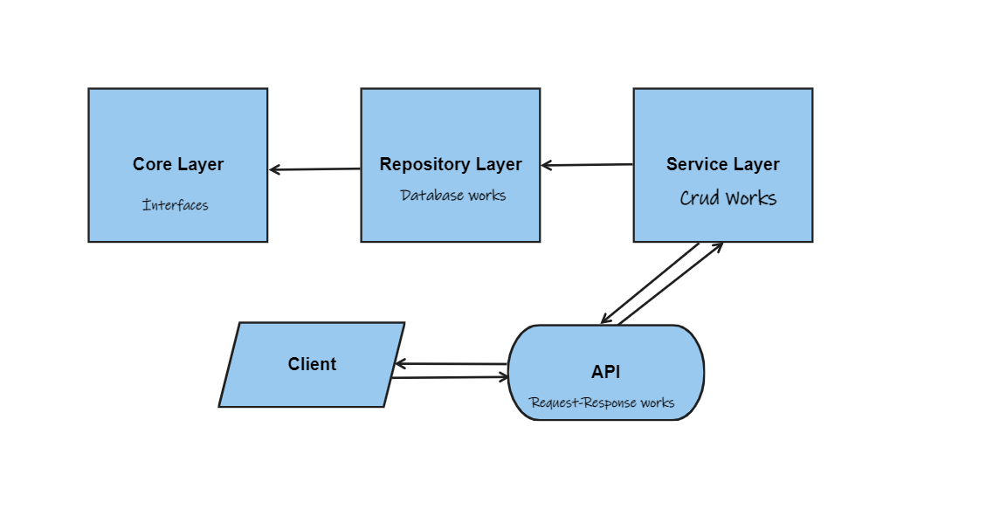
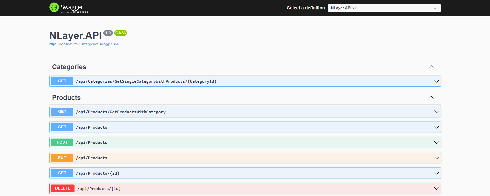
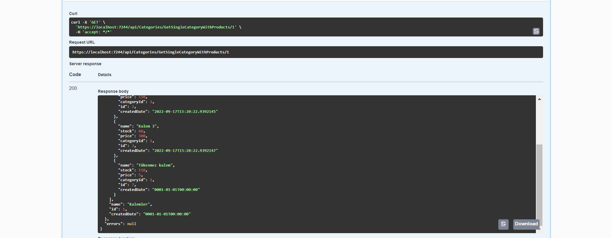
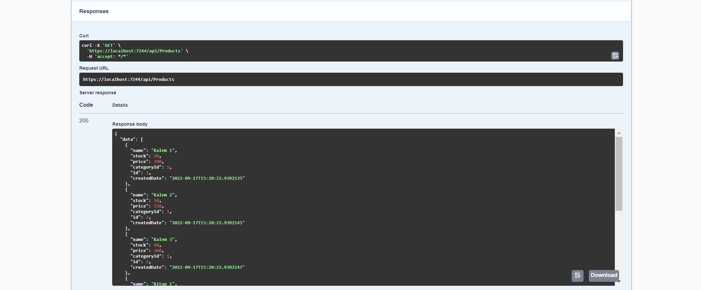
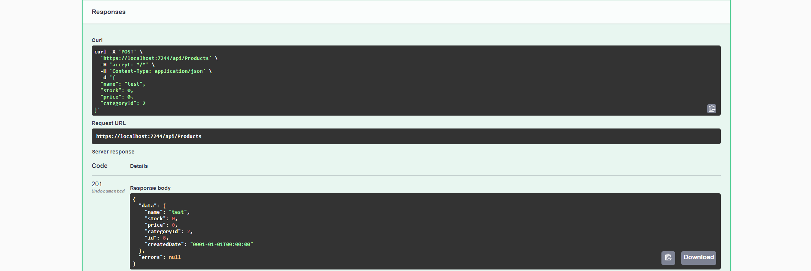

#  .Net Core N-Layer API

Basic design on  products and categories with 3 layers (Core,Repository,Service)

### Using Tech, Design or Library

<table>
<th>
<ul>
      <li>Ef Core </li>
      <li>Repository  </li>
      <li>UnitOfWork </li>
</ul> 
</th>
<th>
<ul>
      <li>AutoMapper </li>
      <li>Code First </li>
      <li>REST API </li>
</ul> 
</th>
</table>

### ScreenShots

